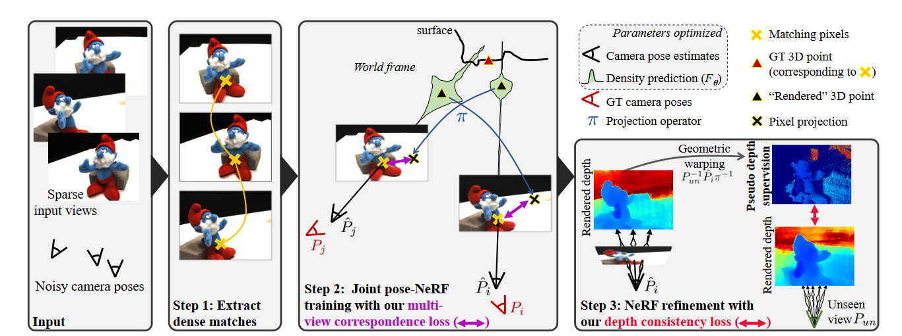
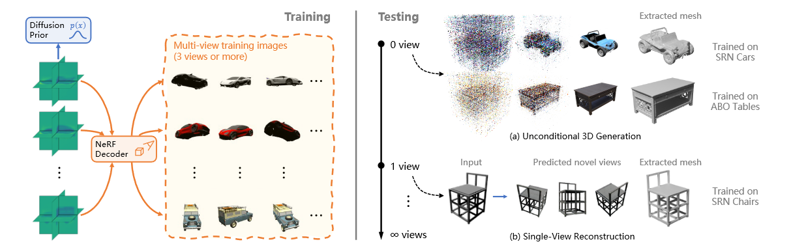
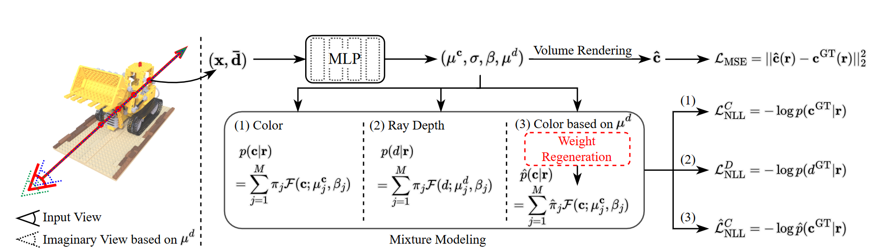
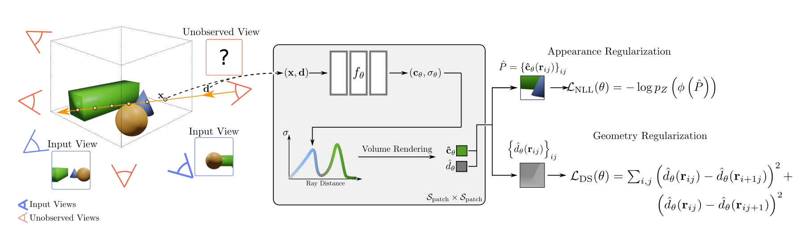
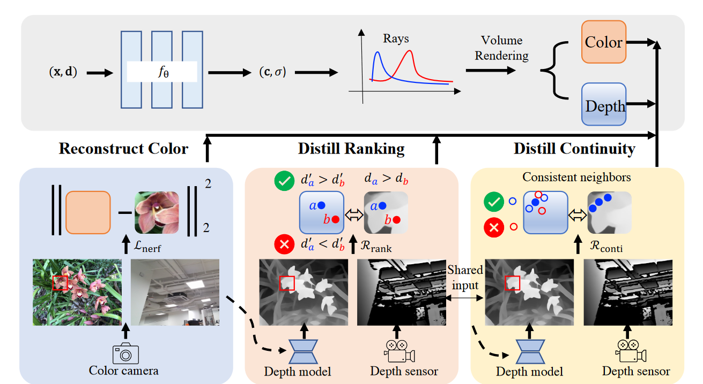
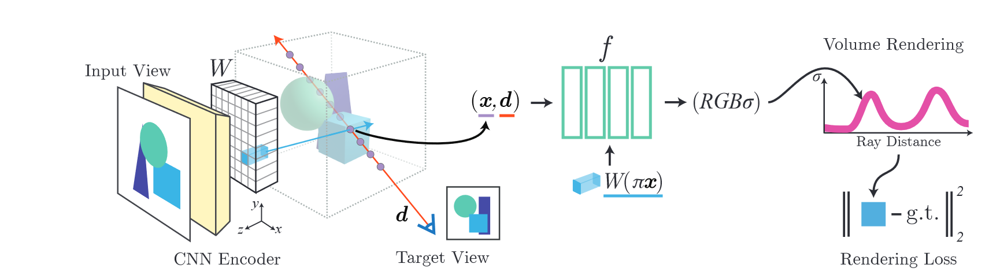

# Spase-NeRF-papers
papers of NeRF with sparse view inputs
# Sparse NeRF
## *Motivation*
1. 稀疏观测下NeRF重建属于under-constrained逆问题，无法重建正确的几何形貌
2. 稠密视图下重建NeRF带来极大的可微渲染的计算开销  
## *Stereo Guided*
### 1. Learning to Render Novel Views from Wide-Baseline Stereo Pairs (CVPR 2023)
### [project](https://yilundu.github.io/wide_baseline/)
#### method  
  
制定了多视图转换器编码器，提出了一个高效的图像空间中心线采样方案来为目标光线提取图像特征，以及一个轻量级的基于交叉注意力的渲染器。我们的贡献使我们的方法能够在大规模的室内和室外场景的真实数据集上进行训练。我们证明了我们的方法在减少渲染时间的同时学习了强大的多视图几何先验。  
对于一对立体视图，文章通过一个特征提取模块（模块加入pose embedding提高特征的多视图一致性）获取两个视图的pixel-wised 特征，之后对于一个待渲染的光线（target ray），根据该光线在两个视图中做投影，得到两个epiray，这两个epiray分别均匀采样并互相投影到对方视图得到两组特征点，共2N个点（一个视图的epiray均匀采样得到N个点）。这组特征点在特征匹配时对应具有相似的特征值，文章通过一个cross attention 模块将该特征提取出来，并通过MLP解码为颜色。  
具体方法为（个人理解），对这2N个点通过MLP建模为key、value，之后将这2N个点的位置信息建模为query token，第一个cross attention模块根据坐标位置关系提取出相应的特征内容，之后将该特征内容concat到query中进行第二轮cross attention，由于匹配的特征在MLP构建的特征空间相比其他特征具有一定特殊性，因此第二轮attention能够将具有特殊性的特征映射到相近的key和query空间，而其他特征的key和query空间位置则较远，最终第二轮的attention主要query出匹配的特征，同时离该特征越远的对应attention map权重越低，从而能够计算粗糙的depth。

### 1. SPARF: Neural Radiance Fields from Sparse and Noisy Poses (CVPR 2023 Highlight)  
### [project](prunetruong.com/sparf.github.io/)
#### method  
  
文章做的时给定稀疏的宽基准输入视图（最少3张）和带噪声的相机位姿，通过多视图几何一致性约束来联合优化NeRF和精调相机位姿的方法，通过额外的几何约束实现稀疏视图下几何重建，并通过由粗到精的训练策略精调相机位姿。具体方法为，通过PDC-Net建立不同视图之间的pixel level的特征匹配对（这种匹配完全可以通过cross-attention配上一个解码器实现，匹配精度完全决定了重建和位姿估计的效果），特征匹配对需要通过一个阈值策略筛选出有效的匹配对（有些物体可能被遮挡），直接通过对PDC-Net输出的匹配概率指定一个阈值实现。之后对于多个输入视图，根据匹配对构建出重投影损失和深度匹配损失（深度根据NeRF渲染计算）。文章采用由粗到精的训练策略，先通过coarseMLP和相机参数联合优化实现位姿估计，之后固定相机参数通过FineMLP和coarseMLP实现高质量NeRF重建，优化过程逐步增加PE的带宽（**先前文章表明逐步增加PE带宽能够有效提升细节表示能力，并且能够避免早期优化出现过拟合**）

## *diffusion*
### 1. Single-Stage Diffusion NeRF: A Unified Approach to 3D Generation and Reconstruction  
### [project (under released)](https://github.com/Lakonik/SSDNeRF)
#### method  
  
提出一个one-stage的NeRF-Diffusion，用于稀疏视图引导下重建3D场景。原始的NeRF-diffution方法通常为two-stage的方法，即首先通过逆渲染过程获得场景的三平面投影的feature（latent code），之后再通过diffusion方法建模latent code的分布。这种方法的缺点在于首先通过逆渲染过程得到的latent code是带有噪声的，那么diffusion在建模过程中就不可避免的同时建模了噪声分布，从而导致生成效果差。那么文章提出的one-stage的方法则是diffusion过程和逆渲染过程联合优化，通过精心设计的超参数保证训练稳定性。测试阶段则是通过图像引导采样过程（Image-Guided Sampling）实现对应场景的latent code生成。具体为用渲染损失关于每一步的去噪图像的梯度作为引导，更新每一步的去噪图像，从而将每一步的分布形式向某一特定场景校准。此外，测试阶段在重建场景的特征投影后需要再次通过渲染损失和扩散损失微调latent code（保证扩散模型和NeRF参数不变）  
文章采用的训练集为ShapeNet SRN和Amazon Berkeley Objects，其中SRN中有cars（2458/703），有chairs（4612/1317），训练数据量在几千量级。最终实现效果为能够在测试集中的稀疏视图图像引导下重建稠密视图/场景  

## *Regularization*  
### 1. MixNeRF: Modeling a Ray with Mixture Density for Novel View Synthesis from Sparse Inputs（CVPR 2023）  
#### method  
   
在稀疏视图输入下重建NeRF主要有两个技术路线，一个是基于预训练的方法，通过大规模数据提供预训练数据先验（diffusion、transformer），引导稀疏视图下NeRF重建，另一种则是基于正则化方法，这种方法通过额外的监督信号比如depth、点云等提供几何先验。文章提出的是基于Regularization的方法，具体为将光线上采样点的颜色和深度位置建模为概率分布形式，从而每条光线的估计颜色和深度建模为混合分布形式（渲染方程），通过GT颜色和SVM计算深度监督下优化混合分布的对数似然函数，实现稀疏视图下的NeRF重建。其中深度监督提供几何信息，解决稀疏视图下几何重建困难的问题。另外在深度分布的估计结果下重生成颜色估计分布作为额外的似然函数，进一步提升对颜色和视点平移的鲁棒性。

### 2. RegNeRF: Regularizing Neural Radiance Fields for View Synthesis from Sparse Inputs (CVPR 2022 (oral))  
### [project](https://m-niemeyer.github.io/regnerf/index.html)
#### method  
  
文章是一种在稀疏投影下重建NeRF场景的正则方法，具体正则方法为在成像空间随机选择target views，由于在稀疏视图下重建NeRF会导致overfitting到输入视图，无法正确重建几何，因此文章对target views的patch渲染结果加入深度平滑损失（TV正则）和先验的外貌正则（通过概率流模型估计自然图像分布形式，之后patch输入到该模型中计算输出的对数似然，通过最大化似然函数保证外貌和自然图像分布一致）。最终的正则项包括重建损失、深度平滑损失、外貌正则。此外，另一个稀疏视图下NeRF重建失败的原因是训练开始的发散行为（个人理解就是单纯的光线颜色缺乏足够的几何约束，从而导致体密度发散到光线的源位置），这种发散行为能够通过逐步缩小采样空间而避免，因此文章额外加入了一个采样空间逐渐收缩的采样策略。 

### 3. SparseNeRF: Distilling Depth Ranking for Few-shot Novel View Synthesis (Technical Report, 2023) 
### [project (under released)](https://sparsenerf.github.io/)
#### method  
  
文章论证了在稀疏视图下，渲染方程数目远小于需要重建空间点数目，属于under-constrained的优化问题，这种优化问题通常需要引入额外的正则，例如RegNeRF采用的新视图深度平滑损失等，或者加入额外的三维信息提供先验正则，或者引入预训练的数据先验。  
本文希望用第二种方法，利用深度图作为额外的正则实现稀疏视图辐射场重建，但是使用深度图做正则存在几个问题：  
1. 利用预训练的深度估计网络只能估计相对位置，和绝对位置之间存在非线性关系。
2. 手持的家用RGBD相机采样深度图时非常稀疏。  

因此文章并非直接用深度图约束NeRF，而是随机采样两个深度点，并约束NeRF预测的深度相对位置保证一致（Rrank），同时采样点附近的patch深度保证变化较小（Rsmooth）。加入这两个额外正则后实现稀疏视图下的NeRF重建。文章额外提供了一组新的RGBD的多视图数据集，同时在DTU，LLFF基准数据集上验证（深度通过深度估计网络提供），和在新数据集上验证。

## *Data Prior*  
### 1. pixelNeRF: Neural Radiance Fields from One or Few Images (CVPR 2021)  
### [project](https://alexyu.net/pixelnerf)
#### method  
  
现有的利用数据先验实现稀疏视图三维重建的方法劣势：

1. 需要有重建目标的mask  
2. 无论学习3D全局表征还是学习空间对齐的局部特征，都需要额外3D监督     

文章提出一种不需要任何额外的3D数据先验的稀疏新视图重建方法，仅利用多视图图像数据集学习多场景的数据先验。方法具体为，训练时随机采样一个输入视图一个目标视图，目标视图正常按照NeRF方法采样空间点，输入视图通过ImageNet预训练的ResNet前4层提取low-level特征，目标视图光线的采样点在输入视图上采样low-level特征，特征和坐标位置、光线方向送入解码器得到体密度和颜色，之后通过重建损失训练解码器。最终得到一个能够根据空间位置、特征（投影得到）和方向计算出体密度和颜色的解码器。训练好之后，给定单个参考视图或多个参考视图，目标新视图渲染能够通过投影在参考视图提取特征-解码-渲染过程得到新视图图像。文章方法能够在ShapeNet合成数据集和DTU真实数据集上实现稀疏视图的NeRF重建。
（感觉方法上泛化性有些局限性，不太清楚解码器到底学到的是啥，感觉像是记忆下某种特征下空间位置的体密度颜色啥的）
