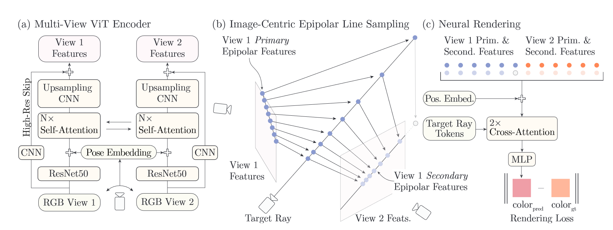
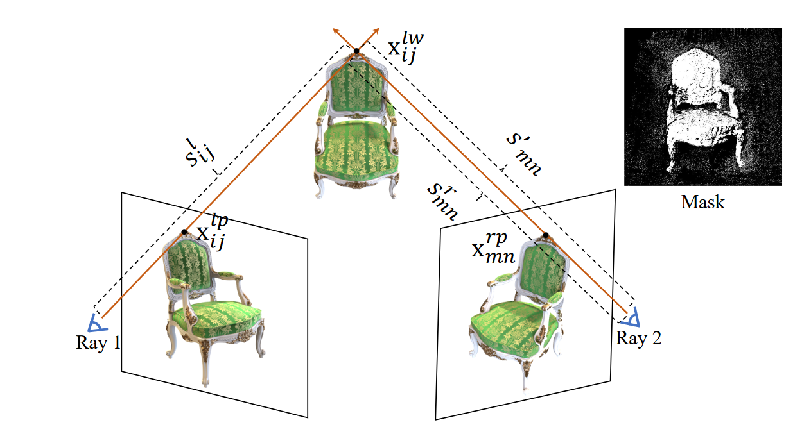
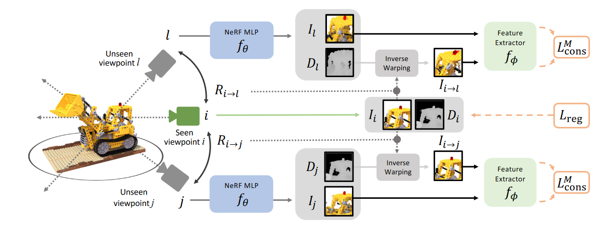
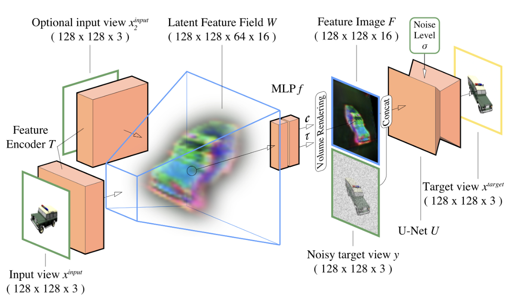
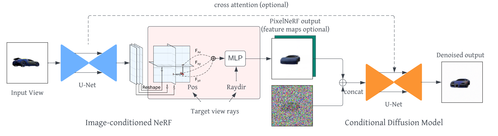
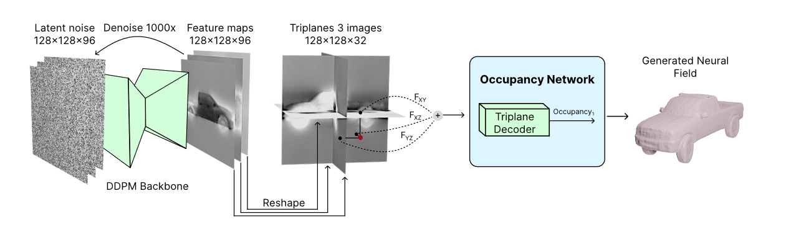
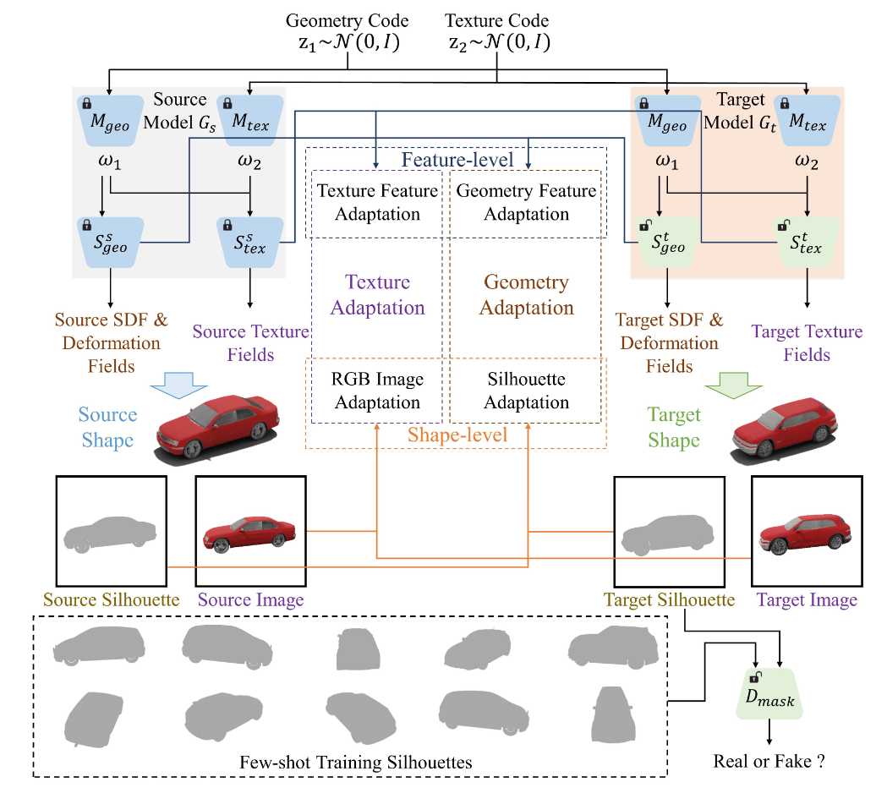
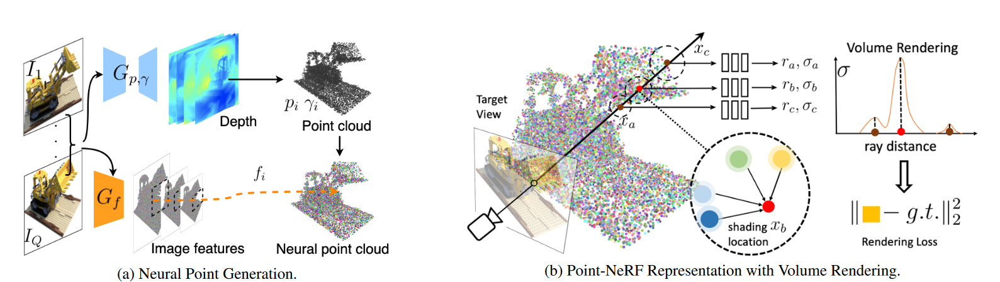

# Sparse NeRF
## ***Motivation***
1. 稀疏观测下NeRF重建属于under-constrained逆问题，无法重建正确的几何形貌
2. 稠密视图下重建NeRF带来极大的可微渲染的计算开销  
## ***Stereo Guided***
### **1. Learning to Render Novel Views from Wide-Baseline Stereo Pairs (CVPR 2023)**
### [project](https://yilundu.github.io/wide_baseline/)
### **Method**  
  
制定了多视图转换器编码器，提出了一个高效的图像空间中心线采样方案来为目标光线提取图像特征，以及一个轻量级的基于交叉注意力的渲染器。我们的贡献使我们的方法能够在大规模的室内和室外场景的真实数据集上进行训练。我们证明了我们的方法在减少渲染时间的同时学习了强大的多视图几何先验。  
对于一对立体视图，文章通过一个特征提取模块（模块加入pose embedding提高特征的多视图一致性）获取两个视图的pixel-wised 特征，之后对于一个待渲染的光线（target ray），根据该光线在两个视图中做投影，得到两个epiray，这两个epiray分别均匀采样并互相投影到对方视图得到两组特征点，共2N个点（一个视图的epiray均匀采样得到N个点）。这组特征点在特征匹配时对应具有相似的特征值，文章通过一个cross attention 模块将该特征提取出来，并通过MLP解码为颜色。  
具体方法为（个人理解），对这2N个点通过MLP建模为key、value，之后将这2N个点的位置信息建模为query token，第一个cross attention模块根据坐标位置关系提取出相应的特征内容，之后将该特征内容concat到query中进行第二轮cross attention，由于匹配的特征在MLP构建的特征空间相比其他特征具有一定特殊性，因此第二轮attention能够将具有特殊性的特征映射到相近的key和query空间，而其他特征的key和query空间位置则较远，最终第二轮的attention主要query出匹配的特征，同时离该特征越远的对应attention map权重越低，从而能够计算粗糙的depth。

### **2. SPARF: Neural Radiance Fields from Sparse and Noisy Poses (CVPR 2023 Highlight)**  
### [project](prunetruong.com/sparf.github.io/)
### **Method**  
  
文章做的时给定稀疏的宽基准输入视图（最少3张）和带噪声的相机位姿，通过多视图几何一致性约束来联合优化NeRF和精调相机位姿的方法，通过额外的几何约束实现稀疏视图下几何重建，并通过由粗到精的训练策略精调相机位姿。具体方法为，通过PDC-Net建立不同视图之间的pixel level的特征匹配对（这种匹配完全可以通过cross-attention配上一个解码器实现，匹配精度完全决定了重建和位姿估计的效果），特征匹配对需要通过一个阈值策略筛选出有效的匹配对（有些物体可能被遮挡），直接通过对PDC-Net输出的匹配概率指定一个阈值实现。之后对于多个输入视图，根据匹配对构建出重投影损失和深度匹配损失（深度根据NeRF渲染计算）。文章采用由粗到精的训练策略，先通过coarseMLP和相机参数联合优化实现位姿估计，之后固定相机参数通过FineMLP和coarseMLP实现高质量NeRF重建，优化过程逐步增加PE的带宽（**先前文章表明逐步增加PE带宽能够有效提升细节表示能力，并且能够避免早期优化出现过拟合**）

### **3. ConsistentNeRF: Enhancing Neural Radiance Fields with 3D Consistency for Sparse View Synthesis**
### [project](https://github.com/skhu101/consistentnerf)   
### **Method**  
  
文章结合了多视图几何一致性和单视图深度一致性共同正则化NeRF重建。多视图几何一致性首先通过MVSNeRF构建mask，在MVSNeRF重建结果中每个像素计算参考视图重投影点的深度和MVSNeRF估计深度的差值，小于一个阈值mask为1，否则为0,通过构建mask保证多视图几何一致性匹配是有效的。构建好mask之后在mask内部计算几何一致性损失（输入视图每个像素根据NeRF估计深度逆投影到3D空间，再投影到目标视图，计算两个视图颜色损失），用于约束多视图NeRF几何重建。另外，文章对于单视图额外引入深度正则，即通过MiDas深度估计模型提供一个相对深度的先验，用该先验对单个视图的NeRF重建结果计算深度损失。文章实际上是立体视觉匹配和额外的深度正则共同作用的结果。

### **4. GECONERF: FEW-SHOT NEURAL RADIANCE FIELDS VIA GEOMETRIC CONSISTENCY**
### [project](https://ku-cvlab.github.io/GeCoNeRF/)   
### **Method**  
  
文章为了实现稀疏视图下NeRF重建，在渲染损失基础上额外构建两个正则：  
1. 在NeRF中结合多视图几何一致性配准方法，在输入视图附近采样unseen views，之后通过NeRF渲染的深度图讲输入视图的patch warp到unseen视图上，并通过特征提取器（VGG-19）构建pixel-wised特征配准损失，保证深度渲染准确和多视图的几何一致性。  
2. 在seen view的深度图上使用TV正则保证深度平滑  

在渲染损失、特征匹配损失和深度平滑正则共同作用下实现稀疏深度重建。训练过程采用两个策略，第一个是随机采样的视图从输入视图位姿开始逐渐向外扩展。第二个是随着迭代进行，MLP带宽从低到高逐渐变化，也就是先重建低频信息，再重建高频信息。  
文章为了保证遮挡区域不进行warp，在特征匹配损失中加入额外的mask。如果seen视图中有一部分区域在unseen视图中被遮挡，那么这部分被遮挡的区域需要加入mask，因为这部分被遮挡的patch如果深度估计准确时warp的话会和其他部分warp到相同位置，在feature约束下会使深度偏离准确值。文章的mask是通过讲seen视图的渲染深度warp到unseen视图并根据和unseen视图的渲染深度损失小于一个阈值来构建的。

为什么用特征匹配损失而不是颜色损失？  
pixel color level的匹配损失一方面在非朗伯材料时会失效（不同视点颜色强度本身不同，导致匹配点的损失大，在经过优化后出现配准偏差）。或者pixel附近颜色强度相近，会导致附近其他点匹配到该像素，此时深度估计不准确但是仍然有较小的损失。最佳方法使pixel level特征配准。   

## ***Generation***
### **1. Single-Stage Diffusion NeRF: A Unified Approach to 3D Generation and Reconstruction**  
### [project (under released)](https://github.com/Lakonik/SSDNeRF)
### **Method**  
  
提出一个one-stage的NeRF-Diffusion，用于稀疏视图引导下重建3D场景。原始的NeRF-diffution方法通常为two-stage的方法，即首先通过逆渲染过程获得场景的三平面投影的feature（latent code），之后再通过diffusion方法建模latent code的分布。这种方法的缺点在于首先通过逆渲染过程得到的latent code是带有噪声的，那么diffusion在建模过程中就不可避免的同时建模了噪声分布，从而导致生成效果差。那么文章提出的one-stage的方法则是diffusion过程和逆渲染过程联合优化，通过精心设计的超参数保证训练稳定性。测试阶段则是通过图像引导采样过程（Image-Guided Sampling）实现对应场景的latent code生成。具体为用渲染损失关于每一步的去噪图像的梯度作为引导，更新每一步的去噪图像，从而将每一步的分布形式向某一特定场景校准。此外，测试阶段在重建场景的特征投影后需要再次通过渲染损失和扩散损失微调latent code（保证扩散模型和NeRF参数不变）  
文章采用的训练集为ShapeNet SRN和Amazon Berkeley Objects，其中SRN中有cars（2458/703），有chairs（4612/1317），训练数据量在几千量级。最终实现效果为能够在测试集中的稀疏视图图像引导下重建稠密视图/场景  

### **2. Generative Novel View Synthesis with 3D-Aware Diffusion Models**  
### [project (under released)]()
### **Method**  
  
PixelNeRF这种regression based方法确实能够根据不同场景的特征重建场景，但是这种回归的模型泛化性能是有限的，比如要求数据集是物体为中心的，那么如果场景中有其他ood的物体或者不是object-centric的，新视图会很模糊。另外很多基于生成的新视图生成方法缺乏几何一致性，只是通过输入视图产生相同分布的新视图，但是没有几何一致性或者缺乏三维的场景结构。这篇文章提出具有几何一致性的基于生成的新视图生成。  
训练的时候，随机采样batch，有输入视图，有target视图，target视图进行前向加噪过程获得每步的噪声图像，如果不加条件，那么就直接利用unet对噪声图像进行去噪，得到的是无条件的噪声分布，去噪结果也是非条件的。但是文章方法通过网络预测frustrum中的3D特征，再投影到targetveiw（MLP根据3D特征估计体密度，通过体渲染将光线上的特征投影到特征平面），得到一个以输入视图和相机参数为输入条件featuremap，这个featuremap和原始DDPM的每步噪声图像（targetview的噪声图像）拼接在一起送入UNET，这样Unet预测的噪声分布就不再是无条件的，而是条件分布，从而得到的去噪结果也是条件分布，实现几何一致偏置的生成过程。  

### **3. NerfDiff: Single-image View Synthesis with NeRF-guided Distillation from 3D-aware Diffusion(ICML 2023)**  
### [project](https://jiataogu.me/nerfdiff/)
### **Method**  
  
这篇文章跟上一篇差不多，都是通过一个网络对输入视图计算3D特征，只不过上一篇是计算的锥体内的voxel特征，这一篇是通过U-Net输出一个三平面的投影特征，然后通过体渲染方式（MLP将3D特征映射为颜色和体密度）投影到targetview得到targetview的图像（上一篇是特征），拼接到targetview的噪声图像中进行CPM的条件去噪过程。

### **4. 3D Neural Field Generation using Triplane Diffusion(CVPR 2023)**  
### [project](https://jryanshue.com/nfd/)
### **Method**  
  
文章提出了一个unconditional的神经场（occupancy field）生成方法，具体过程分两步：第一步通过ShapeNet提供的3D模型的mesh数据训练occupancy network，即在mesh附近随机采样点（占用率label为1），在mesh外随机采样点（内部占用率1，外部占用率0），每个模型构建好gt点的label之后训练三平面特征（每个模型一组特征）和一个decoder（MLP，各个模型共享权重），中间加入了TV正则和EDR正则（每个点和其随机偏置的点占用率做损失），去除无约束区域的伪影以及保证平滑，最终得到一个三平面特征的数据集。第二步用这组数据训练一个2D的DDPM模型，即前向过程特征加噪，逆向过程U-Net去噪，最终U-Net学习到每步的噪声分布。3D模型生成过程通过随机采样噪声，根据U-Net学习到的噪声分布逐步去噪，得到去噪的三平面特征，从而构建出三平面特征表示的占用率场（occupancy field），可以通过raymarching方式query出3D模型的surface。

### **5. Few-shot 3D Shape Generation**  
### [project]()
### **Method**  
  
文章通过域迁移的方式，将在完备数据集上预训练的3Dshape生成模型迁移到目标域，目标域中只有少量样本。文章首先有一个训练好的生成模型（3D GAN），这个生成模型通过一个mapping网络将高斯噪声map到shape和texture的隐空间，之后通过一个3D GAN网络（DMTet）建模为3Dshape。另外对于一个待训练的生成模型，该生成模型结构和预训练模型一致，只不过mapping网络的权重固定，但是生成网络的权重可学习。通过预训练网络和该网络之间进行做一组adaptation损失，包括texture adaptation(两个texture生成器的texture特征以及RGB特征做相似度计算、softmax之后计算二者KL散度)和geometry adaptation(两个shape生成器的shape特征以及投影特征做相似度计算、softmax之后计算二者KL散度)，之后鉴别器对目标域的生成投影和few-shot的GT投影做一个shape的鉴别。通过这种domain adaptation，让target model蒸馏出预训练模型学习到的数据分布，并且能够利用鉴别器有效迁移到目标域，做到比fine-tune更好的效果。

## ***Regularization***  
### **1. MixNeRF: Modeling a Ray with Mixture Density for Novel View Synthesis from Sparse Inputs（CVPR 2023）**  
### **Method**  
   
在稀疏视图输入下重建NeRF主要有两个技术路线，一个是基于预训练的方法，通过大规模数据提供预训练数据先验（diffusion、transformer），引导稀疏视图下NeRF重建，另一种则是基于正则化方法，这种方法通过额外的监督信号比如depth、点云等提供几何先验。文章提出的是基于Regularization的方法，具体为将光线上采样点的颜色和深度位置建模为概率分布形式，从而每条光线的估计颜色和深度建模为混合分布形式（渲染方程），通过GT颜色和SVM计算深度监督下优化混合分布的对数似然函数，实现稀疏视图下的NeRF重建。其中深度监督提供几何信息，解决稀疏视图下几何重建困难的问题。另外在深度分布的估计结果下重生成颜色估计分布作为额外的似然函数，进一步提升对颜色和视点平移的鲁棒性。

### **2. RegNeRF: Regularizing Neural Radiance Fields for View Synthesis from Sparse Inputs (CVPR 2022 (oral))**  
### [project](https://m-niemeyer.github.io/regnerf/index.html)
### **Method**  
  
文章是一种在稀疏投影下重建NeRF场景的正则方法，具体正则方法为在成像空间随机选择target views，由于在稀疏视图下重建NeRF会导致overfitting到输入视图，无法正确重建几何，因此文章对target views的patch渲染结果加入深度平滑损失（TV正则）和先验的外貌正则（通过概率流模型估计自然图像分布形式，之后patch输入到该模型中计算输出的对数似然，通过最大化似然函数保证外貌和自然图像分布一致）。最终的正则项包括重建损失、深度平滑损失、外貌正则。此外，另一个稀疏视图下NeRF重建失败的原因是训练开始的发散行为（个人理解就是单纯的光线颜色缺乏足够的几何约束，从而导致体密度发散到光线的源位置），这种发散行为能够通过逐步缩小采样空间而避免，因此文章额外加入了一个采样空间逐渐收缩的采样策略。 

### **3. SparseNeRF: Distilling Depth Ranking for Few-shot Novel View Synthesis (Technical Report, 2023)** 
### [project (under released)](https://sparsenerf.github.io/)
### **Method**  
  
文章论证了在稀疏视图下，渲染方程数目远小于需要重建空间点数目，属于under-constrained的优化问题，这种优化问题通常需要引入额外的正则，例如RegNeRF采用的新视图深度平滑损失等，或者加入额外的三维信息提供先验正则，或者引入预训练的数据先验。  
本文希望用第二种方法，利用深度图作为额外的正则实现稀疏视图辐射场重建，但是使用深度图做正则存在几个问题：  
1. 利用预训练的深度估计网络只能估计相对位置，和绝对位置之间存在非线性关系。
2. 手持的家用RGBD相机采样深度图时非常稀疏。  

因此文章并非直接用深度图约束NeRF，而是随机采样两个深度点，并约束NeRF预测的深度相对位置保证一致（Rrank），同时采样点附近的patch深度保证变化较小（Rsmooth）。加入这两个额外正则后实现稀疏视图下的NeRF重建。文章额外提供了一组新的RGBD的多视图数据集，同时在DTU，LLFF基准数据集上验证（深度通过深度估计网络提供），和在新数据集上验证。

### **4. Point-NeRF: Point-based Neural Radiance Fields (CVPR 2022 Oral)** 
### [project](https://xharlie.github.io/projects/project_sites/pointnerf/)
### **Method**  
  
文章是基于表面点云的NeRF渲染方法，方法是通过MVSNet首先对多视图图像构建表面点云（也可以通过colamp SFM的方法构建稀疏点云，效果略低但也可以），之后通过一个特征提取网络构建出pixel-level特征，并逆投影到点云上（MVSNet得到的是不同视图深度图，点云是根据depth逆投影得到的），得到具有表面几何、纹理特征以及表面概率的点云数据。在渲染时，还是正常的光线上采样，然后在采样点附近半径R的球体范围内采集这些点云，并加权求和得到该点特征，并通过MLP解码为颜色体密度。除此之外文章针对稀疏点云的可能导致部分采样点采不到特征的问题提出了point grow的方法，随机采样一些光线上的点然后计算这个点的体密度，如果这个点体密度比较大并且离最近的表面点比较远，那么将这个点加入到点云中，这个方法使得colmap得到的稀疏点云也能用这种方法进行渲染。

## ***Data Prior***  
### **1. pixelNeRF: Neural Radiance Fields from One or Few Images (CVPR 2021)**  
### [project](https://alexyu.net/pixelnerf)
### **Method**  
  
现有的利用数据先验实现稀疏视图三维重建的方法劣势：

1. 需要有重建目标的mask  
2. 无论学习3D全局表征还是学习空间对齐的局部特征，都需要额外3D监督     

文章提出一种不需要任何额外的3D数据先验的稀疏新视图重建方法，仅利用多视图图像数据集学习多场景的数据先验。方法具体为，训练时随机采样一个输入视图一个目标视图，目标视图正常按照NeRF方法采样空间点，输入视图通过ImageNet预训练的ResNet前4层提取low-level特征，目标视图光线的采样点在输入视图上采样low-level特征，特征和坐标位置、光线方向送入解码器得到体密度和颜色，之后通过重建损失训练解码器。最终得到一个能够根据空间位置、特征（投影得到）和方向计算出体密度和颜色的解码器。训练好之后，给定单个参考视图或多个参考视图，目标新视图渲染能够通过投影在参考视图提取特征-解码-渲染过程得到新视图图像。文章方法能够在ShapeNet合成数据集和DTU真实数据集上实现稀疏视图的NeRF重建。
（感觉方法上泛化性有些局限性，不太清楚解码器到底学到的是啥，感觉像是记忆下某种特征下空间位置的体密度颜色啥的）
